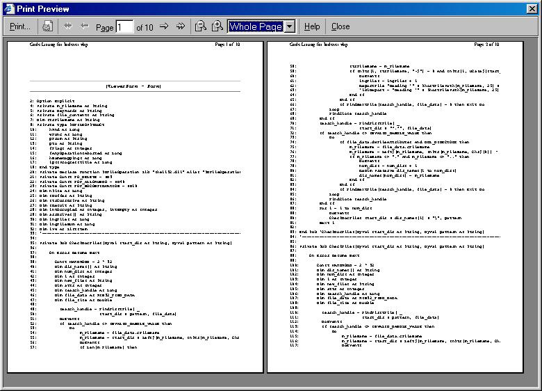



## CodePrint

### Description

CodePrint(addin with Print Preview) - The best code printing utility so far. CodePrint starts where all other codeprinting utilites stop. CodePrint converts your code into html code and then piggybacks on IE's inbuilt functionality to display a Print Preview screen. Here you can view your code and take print as well. The Print Preview screen looks professional and gives you lot of options. So, why waste time in working upon custom made Print Preview functionality when IE's very own Print Preview Screen can meet all your requirements nicely. A very original idea that can be put to use wherever there is need for showing Print Preview Screen. Don't forget to vote for me.
 
### More Info
 

             |
---                |---
**Submitted On**   |2005-05-29 21:04:46
**By**             |[Manoz Shrivastava](https://github.com/Planet-Source-Code/PSCIndex/blob/master/ByAuthor/manoz-shrivastava.md)
**Level**          |Advanced
**User Rating**    |4.8 (24 globes from 5 users)
**Compatibility**  |VB 6\.0
**Category**       |[Complete Applications](https://github.com/Planet-Source-Code/PSCIndex/blob/master/ByCategory/complete-applications__1-27.md)
**World**          |[Visual Basic](https://github.com/Planet-Source-Code/PSCIndex/blob/master/ByWorld/visual-basic.md)
**Archive File**   |[CodePrint1894505302005\.zip](https://github.com/Planet-Source-Code/manoz-shrivastava-codeprint__1-60810/archive/master.zip)

